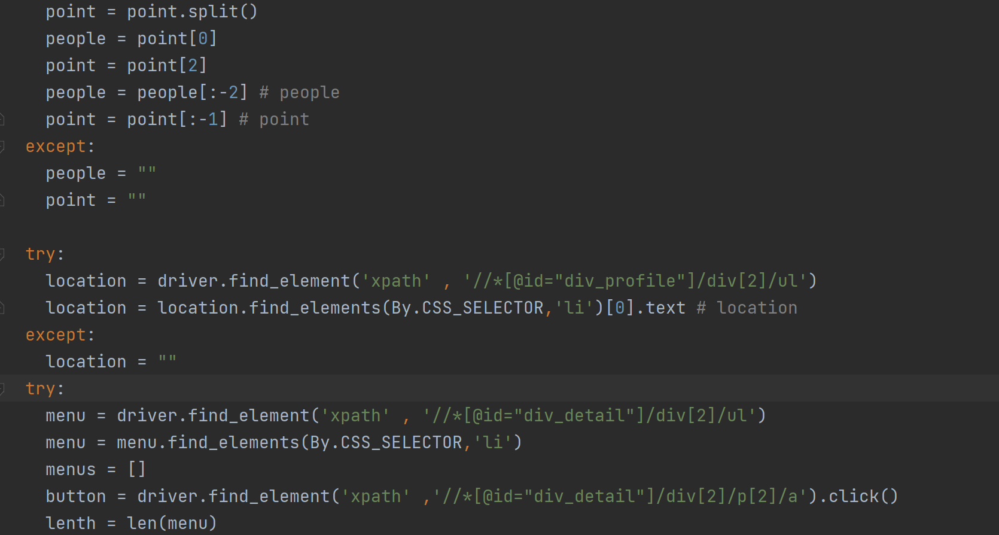
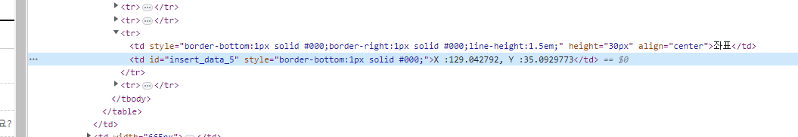

# 개요

카카오 맵 과 네이버 플레이스 api 를 이용해서 맛집 AI 챗봇 개발 - aws 기반으로 예정

1. 첫번째 랜덤 맛집 추천1km 맛집추천
   지역, 음식점(상위 3개)

2. 이 음식점과 비슷한 메뉴의 음식점(상위 키워드로)(상위 3개)
- 새로운 음식점인데, 맛있어, 리뷰가 적어

- 이 음식점과 비슷한 메뉴(어떤 음식을 하고 있는지 키워드만 가지고 있으면)
3. 음식 종류에 따른 맛집 추천(상위 3개) , 위치 키워드
- 서면, 돈까스
  - 서면에 있는 돈까스 맛집 3개가 나오록 구현

망고플레이트

10page까지 하면 넘어가 버린다

평점의 개수가 별로 없으면

맛있다, 괜찮다의 개수

식신

트립어드바이져

키워드 부산 / 동으로  / 진구 부암동

강서구 명지동

리뷰순으로 5명 이상 리뷰한 곳만 긁어오기

다이닝 코드 해서 오기

주소를 따와서 네이버에서 검색해서 좌표 받아오기

구

역

동

## 프로젝트 순서

1. 크롤링(Python 이용해서 데이터 가져오기) - 1~2주
   
   1. 공공데이터 포털을 이용하여 음식점 리스트 가져오기
   2. 네이버 플레이스에서 음식점의 평점과 방문자 리뷰 중 '음식이 맛있어요' 의 비율 가져오기
   3. 음식점 카테고리와 메뉴 가져오기

2. 데이터 전처리 후 AWS RDS 및 AWS DynamoDB에 데이터저장 - 1 주

3. raw 데이터와 음식점 메타데이터를 AWS S3에 저장하여 DataLake 구현 - 3주 
- Athena를 사용해서 쿼리 수행하고 유사도 결과를 별로로 RDS에 저장

- 빅데이터 플랫폼인 EMR 클러스터를 구성하여 S3에 저장된 데이터를 Hadoop 및 Spark로 분석, Zeppelin에서 시각화
  
  - Zeppelin : Spark를 기반으로 한 시각화 도구
4. 입력한 정보를 이용해서 맛집을 추천해줄 수 있는 Serverless 카카오톡 챗봇 서비스 개발 - 2주

## 사용기술

ㅕurl 가져오기

좌표변호ㅘ

메뉴 가져오기

가게이름 ㅇㅇㅇ

평점 ㅇㅇㅇ

리뷰평점 ㅇㅇㅇㅇ

태그 (메뉴 2개) ㅇㅇㅇㅇ

메뉴 > 태그

메뉴 추가

좌표 할당

rocation

- Language : Python 3.9.13
- DB : AWS RDS(MySQL), AWS DynamoDB, AWS S3
- Infra : AWS Lambda, API Gateway, AWS Athena
- API : 공공데이터 포탈, 카카오톡 챗봇, 네이버 지도, 카카오맵

